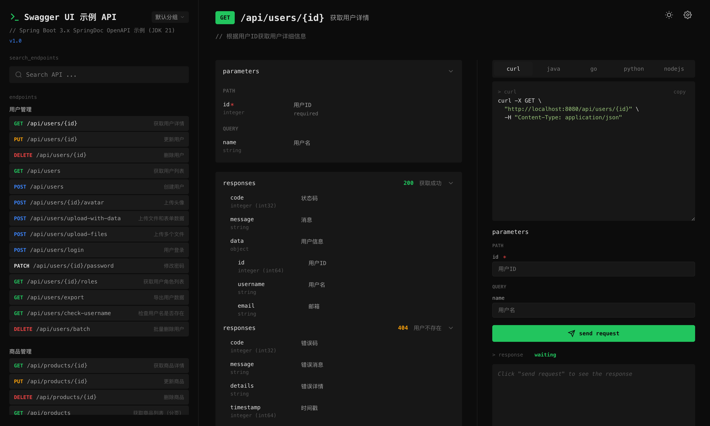
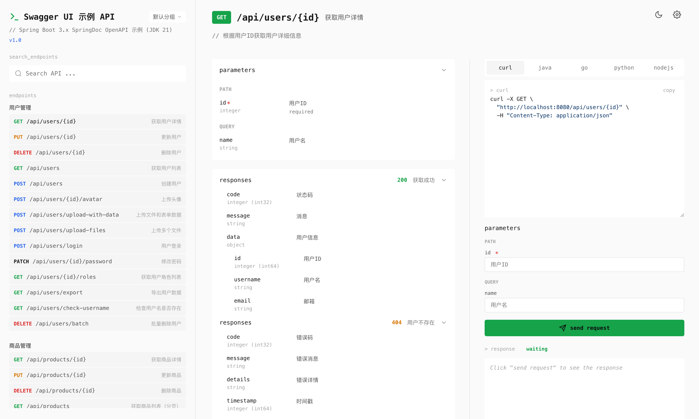

# NEW UI

<p align="center">
  
</p>

<p align="center">
  Compatible with Spring Boot 2.x & 3.x
</p>

<p align="center">
  <a href="#features">Features</a> •
  <a href="#quick-start">Quick Start</a> •
  <a href="#configuration">Configuration</a> •
  <a href="#local-development">Local Development</a> •
  <a href="#tech-stack">Tech Stack</a>
  <a href="./README-CN.md">中文文档</a>
</p>

---

## Features

- 🎨 **Modern UI** - Built with React 19, beautiful and easy-to-use interface with light/dark theme support
- 🔧 **Highly Configurable** - Support custom paths, API URLs, and other configurations
- 📦 **Dual Version Support** - Supports both Spring Boot 2.x and 3.x with a unified Starter
- 🚀 **Zero Intrusion** - No need to modify existing code, just add the dependency
- 🌐 **Group Support** - Complete support for SpringDoc grouping functionality
- ⚡ **Dynamic Injection** - Support injecting dynamic configurations into the page
- 🌙 **Theme Switching** - Built-in light/dark themes with automatic preference saving
- 📱 **Resizable Sidebar** - Support drag-to-resize sidebar width
- 🔐 **Authentication Support** - Bearer Token authentication support
- 💾 **State Persistence** - Auto-saves preferences like theme, group, sidebar width, etc.

<h3 align="center">A modern, beautiful Swagger UI interface</h3>

## Screenshots

| Dark Theme | Light Theme |
|------------|-------------|
|  |  |

## Quick Start

### Requirements

| Component | Version Requirement |
|-----------|---------------------|
| Java | 8+ (Spring Boot 2.x) / 17+ (Spring Boot 3.x) |
| Spring Boot | 2.7.x or 3.x |
| SpringDoc | 1.7.0+ (Boot 2) / 2.3.0+ (Boot 3) |

### 1. Add Dependency

#### Maven

```xml
<dependency>
    <groupId>cn.coget</groupId>
    <artifactId>yudao-swagger-new-ui-boot-starter</artifactId>
    <version>1.0.2-RELEASE</version>
    <type>pom</type>
</dependency>
```

#### Gradle

```groovy
implementation 'cn.coget:yudao-swagger-new-ui-boot-starter:1.0.1-RELEASE'
```

### 2. Add SpringDoc Dependency

Add the corresponding SpringDoc dependency based on your Spring Boot version:

#### Spring Boot 2.x

```xml
<dependency>
    <groupId>org.springdoc</groupId>
    <artifactId>springdoc-openapi-webmvc-core</artifactId>
    <version>1.7.0</version>
</dependency>
```

#### Spring Boot 3.x

```xml
<dependency>
    <groupId>org.springdoc</groupId>
    <artifactId>springdoc-openapi-starter-webmvc-api</artifactId>
    <version>2.8.4</version>
</dependency>
```

### 3. Start Application

After starting your Spring Boot application, visit:

```
http://localhost:8080/swagger-new-ui.html
```

## Configuration

### Complete Configuration Example

Add the following configuration in `application.yml`:

```yaml
swagger-new-ui:
  # Swagger UI access paths, supports multiple paths (comma-separated)
  paths: /swagger-new-ui.html,/swagger-ui.html,/doc.html
  # Base URL path, for context-path scenarios
  base-url: /
  # OpenAPI docs API path
  api-path: /v3/api-docs
  # Custom injected configuration (accessible via window.SWAGGER_UI_CONFIG)
  inject-config:
    custom-key: custom-value
```

### Configuration Properties

| Property | Description | Default Value |
|----------|-------------|---------------|
| `paths` | Swagger UI access paths, supports multiple paths (comma-separated) | `/swagger-new-ui.html` |
| `groups-api-path` | Groups API access path | `/swagger-new-ui/groups` |
| `base-url` | Application base URL path, for context-path scenarios | `/` |
| `api-path` | OpenAPI docs API path | `/v3/api-docs` |
| `inject-config` | Custom configuration injected into the page, accessible via `window.SWAGGER_UI_CONFIG` | `{}` |

### Usage with context-path

If your application has a `context-path` configured, you need to also configure `base-url`:

```yaml
server:
  servlet:
    context-path: /admin

swagger-new-ui:
  base-url: ${server.servlet.context-path}
  paths: swagger-new-ui.html,swagger-ui.html,doc.html
```

Then access at: `http://localhost:8080/admin/swagger-new-ui.html`

## Usage Examples

### Basic Controller Example

```java
@RestController
@RequestMapping("/api/users")
@Tag(name = "User Management", description = "User-related APIs")
public class UserController {

    @GetMapping("/{id}")
    @Operation(summary = "Get user info", description = "Get detailed user information by user ID")
    public Result<UserVO> getUser(
            @Parameter(description = "User ID", required = true)
            @PathVariable Long id) {
        // ...
    }

    @PostMapping
    @Operation(summary = "Create user")
    public Result<UserVO> createUser(@RequestBody UserCreateDTO dto) {
        // ...
    }
}
```

### Configure Groups

Configure API groups using `GroupedOpenApi`:

```java
@Configuration
public class SwaggerConfig {

    @Bean
    public OpenAPI customOpenAPI() {
        return new OpenAPI()
                .info(new Info()
                        .title("API Documentation")
                        .version("1.0"));
    }

    @Bean
    public GroupedOpenApi userApi() {
        return GroupedOpenApi.builder()
                .group("User API")
                .pathsToMatch("/api/users/**")
                .build();
    }

    @Bean
    public GroupedOpenApi orderApi() {
        return GroupedOpenApi.builder()
                .group("Order API")
                .pathsToMatch("/api/orders/**")
                .build();
    }
}
```

## Project Structure

```
yudao-swagger-ui/
├── yudao-swagger-new-ui-boot-starter/    # Spring Boot Starter Module
│   ├── pom.xml
│   └── src/main/
│       ├── java/cn/coget/swagger/autoconfigure/
│       │   ├── SwaggerUiAutoConfiguration.java   # Auto-configuration class
│       │   └── SwaggerUiProperties.java          # Configuration properties class
│       └── resources/
│           ├── META-INF/
│           │   ├── spring.factories              # Spring Boot 2.x auto-config
│           │   └── spring/
│           │       └── org.springframework.boot.autoconfigure.AutoConfiguration.imports  # Spring Boot 3.x
│           └── static/                           # Swagger UI static resources
│               ├── index.html
│               └── assets/
├── examples/                                    # Example Projects
│   ├── yudao-swagger-ui-spring-boot2-example/  # Spring Boot 2.x Example
│   │   └── src/main/
│   │       ├── java/cn/coget/examples/
│   │       │   ├── config/
│   │       │   ├── controller/
│   │       │   ├── dto/
│   │       │   └── vo/
│   │       └── resources/application.yml
│   └── yudao-swagger-ui-spring-boot3-example/  # Spring Boot 3.x Example
│       └── src/main/
│           ├── java/cn/coget/examples/
│           └── resources/application.yml
├── ui/                                          # Frontend Source Code
│   ├── src/
│   │   ├── App.jsx                              # Main App Component
│   │   ├── components/                          # React Components
│   │   │   ├── Sidebar.jsx                      # Sidebar
│   │   │   ├── MainContent.jsx                  # Main Content Area
│   │   │   ├── SettingsModal.jsx               # Settings Modal
│   │   │   ├── icons/                          # Icon Components
│   │   │   └── main-content/                   # Main Content Sub-components
│   │   ├── hooks/                              # Custom Hooks
│   │   └── styles/                             # Style Files
│   ├── package.json
│   └── vite.config.js
└── build.sh                                    # Build Script
```

## Local Development

### Build Complete Project

Use the provided build script to automatically complete frontend build and backend packaging:

```bash
./build.sh
```

This script will:
1. Build the React project (`npm run build:java`)
2. Copy build artifacts to the Starter's static directory
3. Compile and install the Starter to local Maven repository using JDK 8

### Frontend Development

```bash
cd ui

# Install dependencies
npm install

# Development mode (with proxy)
npm run dev

# Build production version (for Java projects)
npm run build:java

# Build standard version
npm run build
```

In development mode, Vite automatically proxies the following paths to the backend:
- `/v3/*` → `http://127.0.0.1:8080`
- `/api/*` → `http://127.0.0.1:8080`
- `/swagger-new-ui/*` → `http://127.0.0.1:8080`

### Run Example Projects

```bash
# Spring Boot 2.x Example
cd examples/yudao-swagger-ui-spring-boot2-example
mvn spring-boot:run

# Spring Boot 3.x Example
cd examples/yudao-swagger-ui-spring-boot3-example
mvn spring-boot:run
```

Access: `http://localhost:8080/admin/swagger-new-ui.html`

### Build Backend Module Only

```bash
cd yudao-swagger-new-ui-boot-starter
mvn clean install -DskipTests
```

### Publish to Maven Repository

```bash
mvn clean deploy
```

> Note: Need to configure repository authentication in `~/.m2/settings.xml`.

## Tech Stack

### Frontend

| Technology | Version | Description |
|------------|---------|-------------|
| React | 19.x | UI Framework |
| Vite | 7.x | Build Tool |
| SCSS | - | Style Preprocessor |
| highlight.js | 11.x | Code Highlighting |

### Backend

| Technology | Version | Description |
|------------|---------|-------------|
| Spring Boot | 2.7.x / 3.x | Application Framework |
| SpringDoc OpenAPI | 1.7.x / 2.x | API Documentation Generation |
| Java | 8+ / 17+ | Runtime Environment |

## Compatibility

| Spring Boot | Java | SpringDoc | Starter |
|-------------|------|-----------|---------|
| 2.7.x | 8+ | 1.7.x | ✅ Supported |
| 3.x | 17+ | 2.x | ✅ Supported |

The Starter is compiled with JDK 8 to ensure compatibility with all versions.

## How It Works

### Auto-Configuration Mechanism

The starter uses Spring Boot's auto-configuration mechanism:

1. **Spring Boot 2.x**: Uses `META-INF/spring.factories` to register the auto-configuration
2. **Spring Boot 3.x**: Uses `META-INF/spring/org.springframework.boot.autoconfigure.AutoConfiguration.imports`

### Dynamic HTML Injection

`SwaggerUiAutoConfiguration` reads the static `index.html` template and injects a `<script>` tag containing `window.SWAGGER_UI_CONFIG` with dynamic configuration values.

### SpringDoc Compatibility

The starter uses reflection to detect and work with both SpringDoc 1.x (Spring Boot 2.x) and SpringDoc 2.x (Spring Boot 3.x):

- SpringDoc 2.x: `org.springdoc.core.models.GroupedOpenApi`
- SpringDoc 1.x: `org.springdoc.core.GroupedOpenApi`

Both versions have a `getGroup()` method that is invoked reflectively.

## FAQ

### Q: How to change the default access path?

A: Configure `swagger-new-ui.paths` in `application.yml`:

```yaml
swagger-new-ui:
  paths: /doc.html
```

### Q: How to configure authentication Token?

A: Click the settings icon in the top-right corner of the interface and enter the Bearer Token.

### Q: How to customize injected configuration?

A: Use the `inject-config` property:

```yaml
swagger-new-ui:
  inject-config:
    app-name: MyApp
    app-version: 1.0.0
```

Accessible in frontend via `window.SWAGGER_UI_CONFIG`.

### Q: Why does Spring Boot 2 and 3 use the same Starter?

A: The Starter is compiled with JDK 8 and is compatible with both Spring Boot 2.x and 3.x. The code dynamically detects the SpringDoc version via reflection and automatically adapts to different APIs.

## Contributing

Issues and Pull Requests are welcome!

## License

[MIT License](LICENSE)

## Acknowledgments

- [SpringDoc OpenAPI](https://springdoc.org/) - OpenAPI 3 documentation generation
- [React](https://react.dev/) - UI framework
- [Vite](https://vitejs.dev/) - Next generation frontend tooling

